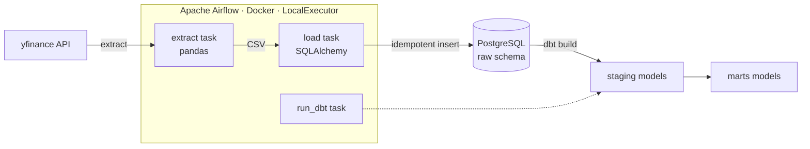

# Stocks Notifier — Daily Stock Price ELT Pipeline

A containerized **ELT data pipeline** that extracts daily stock prices, loads them into a PostgreSQL warehouse, and transforms them into analytics-ready models with dbt — all orchestrated by Apache Airflow and runnable with a single `docker compose up`.

Built as a hands-on data-engineering project to practice production patterns: dependency isolation, idempotent loads, data quality testing, and reproducible containerized infrastructure.

---

## Architecture



The pipeline runs as an Airflow DAG (`daily_stock_upload`) on a `@daily` schedule:

| Task | What it does | Tech |
|------|--------------|------|
| **extract** | Pulls OHLCV prices for a list of tickers from yfinance | `yfinance`, `pandas` |
| **load** | Writes rows to the `raw` schema, skipping duplicates | `SQLAlchemy`, `psycopg2` |
| **run_dbt** | Runs `dbt build` (models + tests) to shape the data | `dbt-postgres` |

Tracked tickers: **AAPL, MSFT, NVDA, TSLA**.

---

## Tech stack

- **Orchestration:** Apache Airflow 2.10.5 (LocalExecutor)
- **Transformation:** dbt (dbt-postgres)
- **Extraction / loading:** Python 3.12, pandas, yfinance, SQLAlchemy
- **Warehouse:** PostgreSQL
- **Infrastructure:** Docker & Docker Compose

---

## Data model

Data flows through three dbt layers, each in its own schema:

```
raw.raw_stock_prices   →   staging.stg_stock_prices   →   marts.mrts_daily_returns
   (as loaded)              (typed & renamed)              (daily returns per ticker)
```

- **raw** — a faithful copy of what the extract produced (`Ticker`, `Date`, `Open`, `High`, `Low`, `Close`, `Volume`, `loaded_at`).
- **staging** (`stg_stock_prices`) — column renaming/typing into clean `snake_case`.
- **marts** (`mrts_daily_returns`) — computes `price_change` and `daily_return` per ticker using window functions (`LAG` over date).

### Data quality tests

The pipeline ships with dbt tests that run as part of `dbt build`:

- **Schema tests** — `not_null` on all key columns across staging and marts.
- **Source freshness** — warns after 3 days / errors after 5 days of stale data.
- **Singular tests:**
  - `assert_high_low` — no row where `high < low`
  - `assert_unique_ticker_date` — no duplicate `(ticker, date)` pairs
  - `assert_all_tickers` — every date has all 4 tickers present

---

## Running it locally

### Prerequisites
- Docker Desktop
- A reachable PostgreSQL database used as the warehouse (the Airflow metadata DB is provided by the compose file)

### 1. Configure secrets

Create a `.env` file in the project root with your warehouse credentials (this file is git-ignored):

```dotenv
DB_HOST=your-postgres-host
DB_PORT=5432
DB_USER=your-user
DB_PASSWORD=your-password
DB_NAME=your-db
```

### 2. Create the raw table

The `raw` schema and `raw_stock_prices` table are created by a bootstrap script:

```bash
python src/sql/create_raw_stocks_table.py
```

### 3. Build and start the stack

```bash
docker compose up --build -d
```

This builds the custom Airflow image and starts the stack: scheduler, webserver, triggerer, an init container, and the Airflow metadata Postgres.

### 4. Open Airflow

Visit **http://localhost:8080** (default login `airflow` / `airflow`), un-pause the `daily_stock_upload` DAG, and trigger a run.

### 5. Stop the stack

```bash
docker compose down
```

---

## How the Docker image works

The custom image ([`Dockerfile`](Dockerfile)) extends the official Airflow image and adds a **second, isolated virtual environment** for the pipeline code and dbt:

- **Env A** — Airflow and its own Python (from the base image).
- **Env B** (`/opt/venvs/market-intel`) — pandas, yfinance, SQLAlchemy, dbt, and the project's `src` package.

The extract/load tasks run in Env B via Airflow's `@task.external_python`, and dbt is invoked by its full path inside Env B. This keeps the pipeline's dependencies from ever conflicting with Airflow's pinned versions. Path locations are passed to the DAG as environment variables, so the same DAG file runs both locally and in the container.

---

## Testing

Python unit tests (with a mocked yfinance call) live in `tests/`:

```bash
pytest
```

---

## Design decisions & highlights

- **Idempotent loads** — the load step uses `INSERT ... ON CONFLICT DO NOTHING`, so re-running the pipeline never creates duplicate rows.
- **Dependency isolation** — pipeline/dbt dependencies live in a separate venv from Airflow, avoiding version conflicts.
- **Resilient extraction** — the extract task retries transient yfinance rate-limits, and cleanly *skips* on non-trading days (weekends) instead of failing.
- **Reproducible infrastructure** — the entire stack is defined in code (`Dockerfile` + `docker-compose.yaml`) and starts with one command.
- **Data quality as code** — dbt schema tests, source freshness, and singular tests run on every build.

---

## Project structure

```
.
├── Dockerfile                 # Custom Airflow image (Env A + isolated Env B)
├── docker-compose.yaml        # LocalExecutor stack + metadata Postgres
├── pyproject.toml             # Pipeline package + dependencies
├── dags/
│   └── daily_stock_upload.py  # The Airflow DAG (extract → load → run_dbt)
├── src/
│   ├── ingestion/             # extract & load logic
│   ├── database/              # SQLAlchemy engine / connection
│   └── sql/                   # raw table bootstrap
├── market_intel/              # dbt project
│   ├── models/
│   │   ├── staging/           # stg_stock_prices
│   │   └── marts/             # mrts_daily_returns
│   └── tests/                 # singular dbt tests
└── tests/                     # pytest unit tests
```

---

## Roadmap

- [ ] Automate the raw-table bootstrap as an Airflow setup task (remove the manual step)
- [ ] Add a local Postgres warehouse option for fully self-contained runs
- [ ] Add a notification step (the "notifier") on price movements
- [ ] CI: run `pytest` (and `dbt build` against a test DB) on every push
- [ ] Expand the ticker universe and add more marts (moving averages, volatility)
