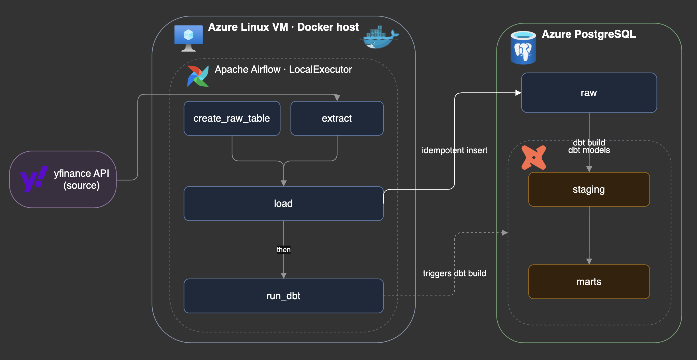

<div align="center">

# 📈 Stocks Notifier

### Daily Stock-Price ELT Pipeline — Airflow · dbt · Docker · Azure

A fully containerized **ELT data pipeline** that extracts daily stock prices, loads them into a cloud PostgreSQL warehouse, and transforms them into analytics-ready models with dbt — orchestrated by Apache Airflow and deployable with a single `docker compose up`.

<br/>


</div>

> Built as a hands-on data-engineering project to practice **production patterns**: dependency isolation, idempotent loads, data-quality testing, reproducible containerized infrastructure, and cloud deployment.

---

## 🏗️ Architecture

<p align="center">
  
</p>

The pipeline runs as an Airflow DAG (`daily_stock_upload`) on a `@daily` schedule:

| Task | What it does | Tech |
|------|--------------|------|
| **create_raw_table** | Ensures the `raw` schema + table exist (idempotent bootstrap) | `SQLAlchemy` |
| **extract** | Pulls OHLCV prices for the tracked tickers from yfinance | `yfinance`, `pandas` |
| **load** | Writes rows to the `raw` schema, skipping duplicates | `SQLAlchemy`, `psycopg2` |
| **run_dbt** | Runs `dbt build` (models + tests) to shape the data | `dbt-postgres` |

**Tracked tickers:** `AAPL` · `MSFT` · `NVDA` · `TSLA`

---

## 🧰 Tech Stack

| Layer | Tooling |
|-------|---------|
| **Orchestration** | Apache Airflow 2.10 (LocalExecutor) |
| **Transformation** | dbt (`dbt-postgres` 1.8) |
| **Extraction / Loading** | Python 3.12, pandas, yfinance, SQLAlchemy |
| **Warehouse** | Azure Database for PostgreSQL *(any PostgreSQL works)* |
| **Infrastructure** | Docker & Docker Compose |
| **Deployment** | Azure Linux VM (Ubuntu) |

---

## 🗂️ Data Model

Data flows through three dbt layers, each in its own schema:

```
raw.raw_stock_prices  →  staging.stg_stock_prices  →  marts.mrts_daily_returns
   (as loaded)             (typed & renamed)            (daily returns per ticker)
```

- **raw** — a faithful copy of what the extract produced (`Ticker`, `Date`, `Open`, `High`, `Low`, `Close`, `Volume`, `loaded_at`).
- **staging** (`stg_stock_prices`) — column renaming & typing into clean `snake_case`.
- **marts** (`mrts_daily_returns`) — computes `price_change` and `daily_return` per ticker via window functions (`LAG` over date).

### ✅ Data-Quality Tests

Run automatically as part of `dbt build`:

- **Schema tests** — `not_null` on all key columns across staging & marts.
- **Source freshness** — warns after 3 days / errors after 5 days of stale data.
- **Singular tests:**
  - `assert_high_low` — no row where `high < low`
  - `assert_unique_ticker_date` — no duplicate `(ticker, date)` pairs
  - `assert_all_tickers` — every date has all 4 tickers present

---

## 🚀 Run It Locally

**Prerequisites:** Docker Desktop, and a reachable PostgreSQL database for the warehouse *(the Airflow metadata DB is provided by the compose file)*.

**1. Configure secrets** — create a `.env` in the project root (git-ignored):

```dotenv
DB_HOST=your-postgres-host
DB_PORT=5432
DB_USER=your-user
DB_PASSWORD=your-password
DB_NAME=your-db
```

**2. Build & start the stack:**

```bash
docker compose up -d --build
```

This builds the custom Airflow image and starts the scheduler, webserver, triggerer, an init container, and the Airflow metadata Postgres. *(The `raw` schema/table is created automatically by the `create_raw_table` task — no manual setup.)*

**3. Open Airflow** → **http://localhost:8080** (login `airflow` / `airflow`), un-pause `daily_stock_upload`, and trigger a run.

**4. Stop the stack:**

```bash
docker compose down
```

---

## ☁️ Deploy to Azure (always-on)

The same stack runs on a cloud VM so the pipeline executes on schedule without a local machine.

**1. Provision** an Ubuntu Server VM (≥ 2 vCPU / 4 GB RAM), SSH-key auth, port **22** open.

**2. Install Docker** on the VM:

```bash
curl -fsSL https://get.docker.com | sudo sh
sudo usermod -aG docker $USER   # then log out & back in
```

**3. Clone & configure:**

```bash
git clone https://github.com/pe5kataa/Stocks_Notifier.git
cd Stocks_Notifier
# copy your .env up from your local machine (secrets never live in git):
# scp -i <key>.pem .env azureuser@<VM-IP>:~/Stocks_Notifier/.env
```

**4. Launch:**

```bash
docker compose up -d --build
```

**5. Access the UI securely** via an SSH tunnel (the UI port stays closed to the internet):

```bash
ssh -i <key>.pem -L 8080:localhost:8080 azureuser@<VM-IP>
# then open http://localhost:8080 locally
```

---

## 🧩 How the Docker Image Works

The custom image ([`Dockerfile`](Dockerfile)) extends the official Airflow image and adds a **second, isolated virtual environment** for the pipeline code and dbt:

- **Env A** — Airflow and its own Python (from the base image).
- **Env B** (`/opt/venvs/market-intel`) — pandas, yfinance, SQLAlchemy, dbt, and the project's `src` package.

The extract/load tasks run in Env B via Airflow's `@task.external_python`, and dbt is invoked by its full path inside Env B. This keeps the pipeline's dependencies from ever conflicting with Airflow's pinned versions. Paths are passed to the DAG as environment variables, so the **same DAG file runs both locally and in the container**.

---

## 🧪 Testing

Python unit tests (with a mocked yfinance call) live in `tests/`:

```bash
pytest
```

---

## 💡 Design Decisions & Highlights

- **Idempotent loads** — `INSERT ... ON CONFLICT DO NOTHING`, so re-runs never duplicate rows.
- **Dependency isolation** — pipeline/dbt deps live in a separate venv from Airflow, avoiding version conflicts.
- **Pinned dependencies** — dbt (and its transitive `dbt-core`) are pinned so every build is reproducible across machines.
- **Resilient extraction** — retries transient yfinance rate-limits, and cleanly *skips* on non-trading days instead of failing.
- **Reproducible infrastructure** — the whole stack is defined in code and starts with one command, locally or in the cloud.
- **Data quality as code** — schema tests, source freshness, and singular tests run on every build.

---

## 📁 Project Structure

```
.
├── Dockerfile                 # Custom Airflow image (Env A + isolated Env B)
├── docker-compose.yaml        # LocalExecutor stack + metadata Postgres
├── pyproject.toml             # Pipeline package + pinned dependencies
├── dags/
│   └── daily_stock_upload.py  # The Airflow DAG (bootstrap → extract → load → run_dbt)
├── src/
│   ├── ingestion/             # extract & load logic
│   ├── database/              # SQLAlchemy engine / connection
│   └── sql/                   # raw-table definition & bootstrap
├── market_intel/              # dbt project
│   ├── models/
│   │   ├── staging/           # stg_stock_prices
│   │   └── marts/             # mrts_daily_returns
│   └── tests/                 # singular dbt tests
└── tests/                     # pytest unit tests
```
